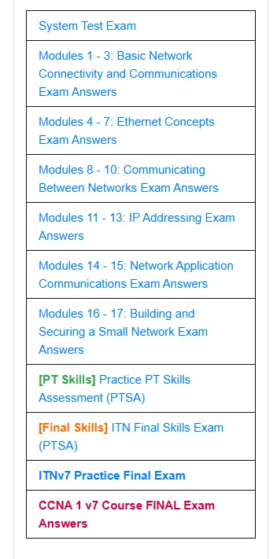

本说明针对周三班，周四班结合实际课程要求观看

上课的老师是张昱，做实验的时候史笑欣老师也在（偏年长的那个），王玮在第八节课来讲一节

八个实验，四个选做实验（课本是实验讲义，建议一组至少有一本，不然会很难受）

附加一参考附加四（转换模式时使用有线连接，可以先用有线连接设置好密码，然后去插老师的交换机接入校网，接着禁用有线网卡，使用无线连接AP来转成AP Router模式，注意不要使用快速设置，在右上角选择模式即可，然后参考附加四第二种方法设置WAN口，填认证服务器和自己vpn用户名密码，不需要像附加四一样复制网卡，选择自动即可）

附加二查密码简单（可百度），

附加三（简单，直接用路由器易联只按被易联的子路由器的易联按钮即可，也可以看路由器背面的MAC来确定是不是自己的路由器），

附加四参考钉钉说明

（如果大组内有大佬也可以蹭他们的附加实验，让老师签大组的，可能会少分数）

在线学习（xzzd+思科网站，建议xzzd每周刷下，思科可以一起搞），xzzd还有两个实验讨论要完成，可以在后期复制同课程人的答案

在线考试（至少完成一个，刷100，也可以刷完拿奖品） 

（答案网站，英文的，要开着翻译做，百度到的可能有错且漏题）

[netacad.cn](http://netacad.cn)或https://portal.netacad.cn/learning

https://itexamanswers.net/ccna-1-v7-0-final-exam-answers-full-introduction-to-networks.html

网页右侧是目录

实验四实验五的总结，课上会提醒截图，要求用模板封面，电子稿写完打印提交（必做）

PT相关提高性要求 ITN Final ， PTSA（选做考试），答案在上面网站，要求用pt做，

附加仿真实验PT（选做） （东西在本地上课资料目录）

一份手写的在线学习心得（必做）
